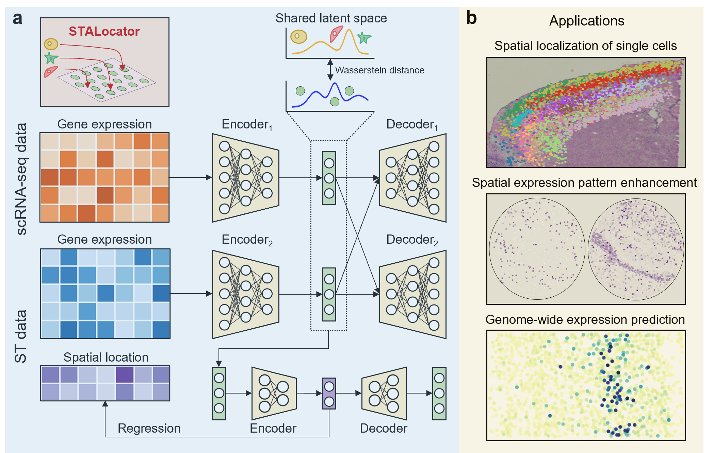

# STALocator

## Overview
STALocator is a method that spatially localizes scRNA-seq data through integration 
with ST data. STALocator is a deep learning-based tool consisting of an integration 
network that integrates scRNA-seq data with ST data and a localization network that 
predicts spatial location for scRNA-seq data. 
Among them, the integration network adopted the modified 
[domain translation networks](https://www.nature.com/articles/s43588-022-00251-y) 
equipped with [sliced Wasserstein distance](https://ieeexplore.ieee.org/document/8578465) 
to robustly align scRNA-seq and ST data. 
The localization network adopted the 
[spatial location-supervised auto-encoder](https://proceedings.neurips.cc/paper/2018/hash/2a38a4a9316c49e5a833517c45d31070-Abstract.html) 
equipped with well-designed loss function to robustly fit low-dimensional 
representations and spatial locations for ST data. We designed different 
pipelines for ST data with different resolutions, 
which can be applied on different biological scenarios. 

For low-resolution ST data, such as Spatial Transcriptomics and 10x Visium, 
we first train an integration network to obtain a low-dimensional representation 
that removes batch effects, and then train a localization network to predict the 
spatial location of cells. Single-cell data with spatial location information 
can be can be considered as a higher-resolution form of spatial transcriptome 
data compared to raw ST data. 
For high-resolution ST data, such as Slide-seq and FISH, it already has a 
resolution close to that of scRNA-seq data, so we only train the integration 
network, and update the optimal transport (OT) plan during the training process, 
and finally we can obtain a global OT plan 
from scRNA-seq data to ST data which can be used to enhance ST data. 
For Slide-seq data, exhibits more distinct and discernible patterns than raw data. 
Furthermore, it is noteworthy that FISH data presents a limitation in terms of 
the number of measurable genes. In light of this constraint, the application 
of our approach enables the acquisition of genome-wide ST data, 
addressing this limitation effectively.



## Prerequisites
It is recommended to use a Python version between `3.7` and `3.9`, and a R version above `4.2`.

## Software dependencies
The important Python packages used to run the model are as follows: 
```
scanpy>=1.8.2,<=1.9.6
torch>=1.8.0,<=1.13.0
torchvision>=0.9.0,<=1.14.0
POT==0.9.0
```
In addition, if you choose to use GPU, the versions of torch and torchvision 
need to be compatible with the version of CUDA.

The important R packages used to process data and perform enrichment analysis are as follows:
```
Seurat==4.2
SeuratData==0.2
GSEABase==1.60
DOSE==3.24
fgsea==1.24
clusterProfiler==4.6
org.Mm.eg.db==3.16
AnnotationDbi==1.60
```


## Installation
After download STALocator from [Github](https://github.com/zhanglabtools/STALocator), 
you can install STALocator via
```
cd STALocator-main
python setup.py build
python setup.py install
```
In addtion, if you choose to install STALocator in a virtual environment, 
you should install the imageio and igraph packages first. 

And if you choose to use R in jupyter notebook, 
you should install the R kernel in jupyter notebook first. 

## Tutorials
The following are detailed tutorials. Some related additional files can be downloaded [here](https://drive.google.com/drive/folders/1LX6hlI1gWtflLbl-hkghAtUu0aQG95Gi).

1. [Simulation experiment](./tutorials/T1_simulation_experiment.ipynb)

2. Localization of human brain [MTG](./tutorials/T2_human_MTG_DLPFC.ipynb) and [M1](./tutorials/T2_human_M1_DLPFC.ipynb) cells on human DLPFC sections

3. [Localization of human SCC cells on tissue sections](./tutorials/T3_human_SCC.ipynb)

4. [Data enhancement of mouse hippocampus Slide-seq dataset](./tutorials/T4_mouse_hippo_slideseq.ipynb)

5. [Data extension of mouse visual cortex STARmap dataset](./tutorials/T5_mouse_visual_cortex_starmap.ipynb)

